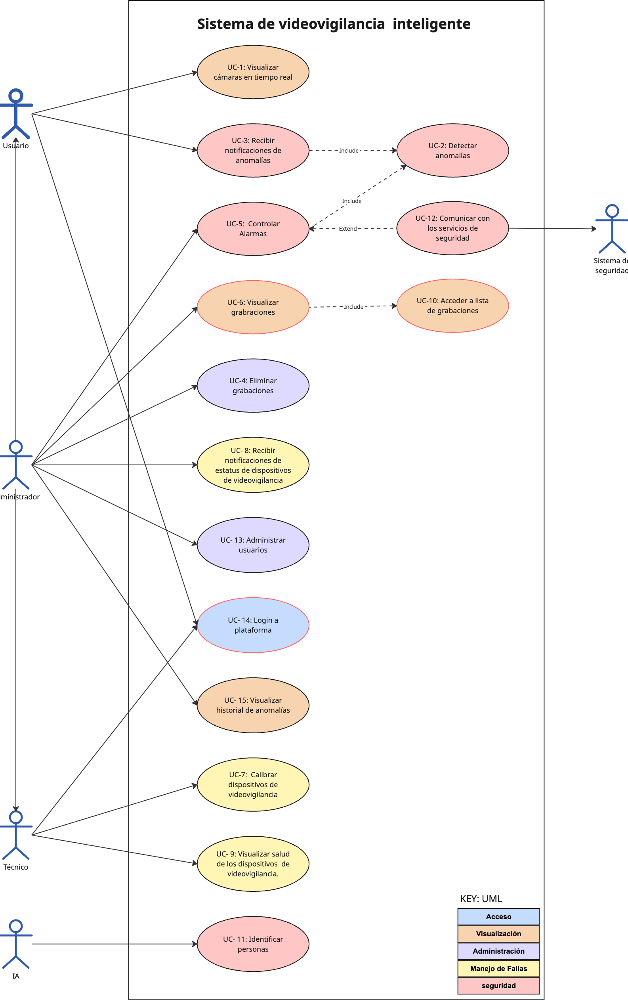

<!-- Portada (sin HTML) -->
 
**Profesor**: Dr. Eduardo López Domínguez  


\newpage

## Resumen

El propósito del proyecto es diseñar una arquitectura de referencia que habilite sistemas de videovigilancia inteligentes capaces de: 

(1) **sensar y transmitir video** desde múltiples dispositivos
(2) **procesar información** para detectar anomalías 
(3) **notificar eventos relevantes** en tiempo real
(4) **operar de forma resiliente** ante desconexiones
(5) **minimizar tráfico de red y costos** de almacenamiento/operación.  

La arquitectura se apoya en una interacción entre componentes de captura y analítica, administración de dispositivos, almacenamiento de evidencia y aplicaciones cliente multiplataforma. Además, se establecen **restricciones tecnológicas** (p. ej., cliente móvil en Kotlin) y requerimientos que guían el diseño (integración de fuentes heterogéneas, calibración, extensibilidad, y seguridad).


# Introducción

El crecimiento de soluciones de videovigilancia en entornos corporativos, industriales, logísticos y residenciales ha incrementado la demanda de plataformas capaces de **capturar, procesar y analizar video en tiempo real**, así como de **generar alertas oportunas** para prevenir incidentes. Sin embargo, los enfoques tradicionales—basados en transmisión continua a la nube y monitoreo manual—enfrentan desafíos importantes como **saturación de red**, **costos elevados**, **falsos positivos** y **pérdida de visibilidad ante fallas de conectividad**.

Este documento presenta una **arquitectura de software de referencia** para el desarrollo de sistemas de videovigilancia inteligentes. La propuesta se orienta a guiar decisiones arquitecturales considerando atributos de calidad (desempeño, disponibilidad, seguridad, etc.), restricciones del proyecto y un conjunto de casos de uso representativos del dominio.

## Contexto

Es una empresa tecnológica especializada en proveer e instalar soluciones de seguridad electrónica y videovigilancia de última generación. Su mercado principal incluye corporativos, complejos industriales, centros logísticos y áreas residenciales de alta seguridad.

## Problema

- **Saturación de red y altos costos de nube:** Transmitir video de alta resolución 24/7 de decenas de cámaras hacia la nube satura el ancho de banda y genera facturas de almacenamiento exorbitantes.
- **Reactividad en lugar de prevención:** Los sistemas tradicionales solo sirven para ver qué pasó *después* del incidente. Nadie puede mirar 50 monitores al mismo tiempo sin perder detalles.
- **Fatiga de alarmas (Falsos positivos):** Las alertas basadas en simple "detección de movimiento" se disparan por sombras, lluvia o animales, provocando que los operadores ignoren las notificaciones reales.
- **Vulnerabilidad ante caídas de red:** Si el internet falla en un almacén remoto, el sistema queda ciego y no se registra la evidencia.

# Arquitectura de software propuesta

La arquitectura de referencia busca equilibrar **analítica inteligente**, **monitoreo continuo**, **almacenamiento de evidencia** y **operación tolerante a fallas**, considerando restricciones de implementación y despliegue. En particular, se promueve incorporar un paradigma de cómputo distribuido (**Cloud, Edge computing**) para reducir latencia, limitar el tráfico de red y mantener operación ante conectividad intermitente.

## Caso del negocio


### Objetivo del proyecto

Diseñar una arquitectura de software de referencia para el desarrollo de sistemas de videovigilancia inteligentes que permita captura, análisis y gestión de evidencia en tiempo real, con operación resiliente y coste eficiente.


### Consideraciones de alcance 

- Considerar una **aplicación multiplataforma** orientada a usuarios que pueda utilizarse desde teléfono inteligente, tableta, laptop y computadora de escritorio.
- Considerar una **aplicación móvil para administradores**, tomando en cuenta las **últimas tres versiones de Android** y utilizando **Kotlin**.
- La información utilizada por las aplicaciones será consumida **principalmente de forma remota**.
- Realizar un diseño acorde a recomendaciones de **mejores prácticas**.
- Integrar el paradigma de computación: **Cloud**.

## Requerimientos del sistema

### Tabla de requerimientos

| ID | Requisito | Tipo |
|---:|-----------------|:--------:|
| R1 | Captura y transmisión de video en tiempo real | Funcional | 
| R2 | Procesamiento en tiempo real y detección de anomalías | Funcional | 
| R3 | Almacenamiento, retención y gestión de grabaciones (indexado, búsqueda y eliminación segura) | Funcional |
| R4 | Gestión y calibración de dispositivos; telemetría y monitor de estatus | Funcional | 
| R5 | Gestión de usuarios y control de acceso (autenticación, autorización y roles) | Funcional | 
| R6 | Control de alarmas y orquestación de notificaciones (reglas, escalamiento) | Funcional | 
| R7 | Integración con servicios externos y APIs (envío/recepción de eventos) | Funcional |
| R8 | Identificación y análisis biométrico (POC), con cumplimiento de privacidad | Funcional | 
| R9 | Rendimiento y eficiencia de red (latencia objetivo < 500 ms para visualización en condiciones nominales; minimizar tráfico mediante Edge/Fog) | No funcional | 
| R10 | Disponibilidad, resiliencia y sincronización offline (persistencia local y re-sincronización segura) | No funcional | 
| R11 | Seguridad y privacidad (cifrado en tránsito/Reposo, registro de auditoría, control de accesos) | No funcional | 

### Modelo de casos de uso

#### Diagrama
{fig-alt="Modelo de casos de uso" width=80%}

#### Tabla de casos de uso

| ID    | Caso de Uso | Descripción |
|------:|------------------|---------------------|
| UC-1  | Visualizar cámaras en tiempo real | Un usuario a través una interfaz interactiva, accede y observar de forma continua y sin latencia perceptible las transmisiones de video en vivo capturadas por las cámaras distribuidas. |
| UC-2  | Detectar anomalías | Se analizan los flujos de video de manera constante para identificar automáticamente patrones inusuales, intrusiones, merodeo o situaciones de riesgo. |
| UC-3  | Recibir notificaciones de anomalías | El usuario recibe notificaciones de manera automática, en tiempo real a través de sus dispositivos cuando el sistema analítico identifica un evento de riesgo. |
| UC-4  | Eliminar grabaciones | El administrador suprime de forma segura y definitiva los archivos de video históricos y los registros de eventos almacenados, ya sea por acción manual o mediante la ejecución automática de las políticas de retención para optimizar el espacio en disco. |
| UC-5  | Controlar Alarmas | Las alarmas se activan de forma automática en caso de detectar ciertas anomalías. El administrador puede activar o desactivar las alarmas desde cualquier parte. |
| UC-6  | Visualizar grabaciones | El usuario reproduce los segmentos de video históricos almacenados a través de la interfaz multiplataforma, permitiendo a los usuarios autorizados analizar eventos pasados mediante controles de reproducción interactivos. |
| UC-7  | Calibrar dispositivos de videovigilancia | El técnico ajusta y configura los parámetros ópticos y sensores a través de la aplicación de administración, para optimizar la captura de datos y reducir las falsas alarmas del sistema. |
| UC-8  | Recibir notificaciones de estatus de dispositivos de videovigilancia | En caso de falla de un dispositivo de videovigilancia el administrador recibirá una notificación informando de la falla de dicho dispositivo. |
| UC-9  | Visualizar salud de los dispositivos de videovigilancia | El administrador monitorea el rendimiento de la infraestructura física, por medio de un panel de control general que detalla la integridad de cada elemento. |
| UC-10 | Acceder a lista de grabaciones | El administrador puede visualizar una lista de grabaciones y seleccionar un elemento para visualizar dicha grabación. |
| UC-11 | Identificar personas | Algoritmos de inteligencia artificial realizan reconocimiento facial sobre las transmisiones de video en tiempo real. |
| UC-12 | Comunicar con los servicios de seguridad | El sistema se puede enlazar con sistemas de seguridad externos. |
| UC-13 | Manejar usuarios | El administrador puede otorgar o denegar el acceso al sistema para los usuarios, además de asignarle distintos niveles de privilegios. |
| UC-14 | Login a plataforma | Los usuario ingresan al sistema a través de sus credenciales. |
| UC-15 | Visualizar historial de anomalías | El usuario puede consultar el historial de anomalías detectadas previamente, incluyendo detalle de eventos, filtros y reproducción asociada (si aplica). |

### Escenarios de atributos de calidad

```{=latex}
\vspace{0.3cm}
\begingroup
\renewcommand{\arraystretch}{1.5}
```

| ID    | Atributo de calidad | Escenario | Caso de uso asociado |
|------:|---------------|-----------------------|---------------|
| QA-1  | Performance | Una transmisión de video en tiempo real se debe visualizar con una latencia < 500 ms, cuando el usuario seleccione un dispositivo de videovigilancia en el panel de monitoreo. | UC-1 |
| QA-2  | Modificabilidad | Un dispositivo físico de videovigilancia se reemplaza por uno de distinto, sin importar la marca y/o modelo. El dispositivo se agrega sin realizar un cambio en el código fuente del sistema. | All |
| QA-3  | Extensibilidad | Se pueden agregar mas sensores y alarmas al sistema modificando un 0% del código fuente del sistema. | All |
| QA-4  | Seguridad | Un técnico puede conectar un nuevo dispositivo de videovigilancia al sistema, solo si el dispositivo se encuentra registrado en el panel de control general. | UC-1, UC-5, UC-7 |
| QA-5  | Disponibilidad | En caso de desconexión el sistema persistirá en forma local la transmisión de video, de tal forma que una vez que recupere la conexión se deberá subir al panel de grabaciones sin afectar el performance del sistema. | UC-1, UC-6 |
| QA-6  | Ligereza | Se debe poder visualizar la transmisión en tiempo real o bien las grabaciones desde dispositivos móviles. | UC-1, UC-6 |
| QA-7  | Almacenamiento | El sistema debe ser capaz de almacenar el 100% de los eventos importantes para el usuario. | UC-1, UC-6 |
| QA-8  | Adaptabilidad | El sistema de videovigilancia debe de poder realizar el 100% de sus funciones sin importar que haya cambios en el ambiente. | All |
| QA-9  | Performance | La arquitectura debe de minimizar el tráfico en la red. | All |
| QA-10 | Seguridad | Solo usuarios autorizados podrán ingresar al sistema con sus credenciales. | All |
| QA-11 | Performance | La información registrada por los dispositivos de videovigilancia será tratada sin afectar el rendimiento del sistema. | All |

```{=latex}
\endgroup
```


### Restricciones

| ID    | Restricción | Descripción |
|------:|------------|-------------------|
| CON-1 | Desarrollo en Kotlin | El desarrollo de la aplicación móvil cliente debe realizarse obligatoriamente utilizando el lenguaje Kotlin. |
| CON-2 | Aplicación Multiplataforma | Desarrollar una interfaz unificada y adaptable, accesible desde smartphones, tablets, laptops y computadoras de escritorio. |
| CON-3 | Consumo Remoto de Datos | Diseñar las aplicaciones cliente para acceder y visualizar la información y los videos a través de la red, sin depender del almacenamiento local del dispositivo. |

### Preocupaciones arquitecturales


| ID    | Consideraciones arquitectónicas |
|------:|-----------------------------------|
| CRN-1 | Establecer una estructura inicial general del sistema. |
| CRN-2 | La aplicación será multiplataforma orientada para los administradores; se aprovechará el conocimiento del equipo sobre tecnologías web como React JS, Vue JS. |
| CRN-3 | La aplicación será multiplataforma orientada para los usuarios; se aprovechará el conocimiento del equipo sobre Kotlin Compose con MVVM. |
| CRN-4 | Utilización de los servicios de Firebase Cloud Messaging para enviar las notificaciones de alertamiento a los dispositivos móviles de los usuarios. |

## Cronograma de Iteraciones

Se propone el siguiente cronograma de trabajo en 3 iteraciones. Para cada iteración se indican las entradas (casos de uso priorizados), las salidas (entregables principales) y los artefactos resultantes.

| Iteración | Entradas (casos de uso) | Salidas (entregables) | Artefactos resultantes |
|:--------:|:-----------------------|:---------------------|:-----------------------|
| Iteración 1 | UC-14 (Login), UC-1 (Visualizar cámaras), UC-2 (Detectar anomalías), UC-3 (Notificaciones) | Prototipo de interfaz de visualización en tiempo real; módulo de autenticación; pipeline básico de ingestión y detección | Demo funcional (vídeo simulado), API de autenticación, reporte de pruebas iniciales |
| Iteración 2 | UC-6 (Visualizar grabaciones), UC-4 (Eliminar grabaciones), UC-7 (Calibrar dispositivos), UC-8 (Notificaciones de estatus) | Módulo de almacenamiento y reproducción; interfaz de gestión de grabaciones; herramientas de calibración; monitor de estatus de dispositivos | Repositorio con pruebas de integración, scripts de retención, guía de usuario parcial |
| Iteración 3 | UC-5 (Controlar alarmas), UC-9 (Salud de dispositivos), UC-10 (Lista de grabaciones), UC-11 (Identificar personas), UC-12 (Integración externa), UC-13 (Manejo de usuarios), UC-15 (Historial de anomalías) | Sistema de control de alarmas; dashboard de salud; POC de reconocimiento facial; integración con servicios externos; sistema de gestión de usuarios; historial de anomalías con búsqueda | Versión RC para despliegue, documentación técnica completa, informe de validación |


