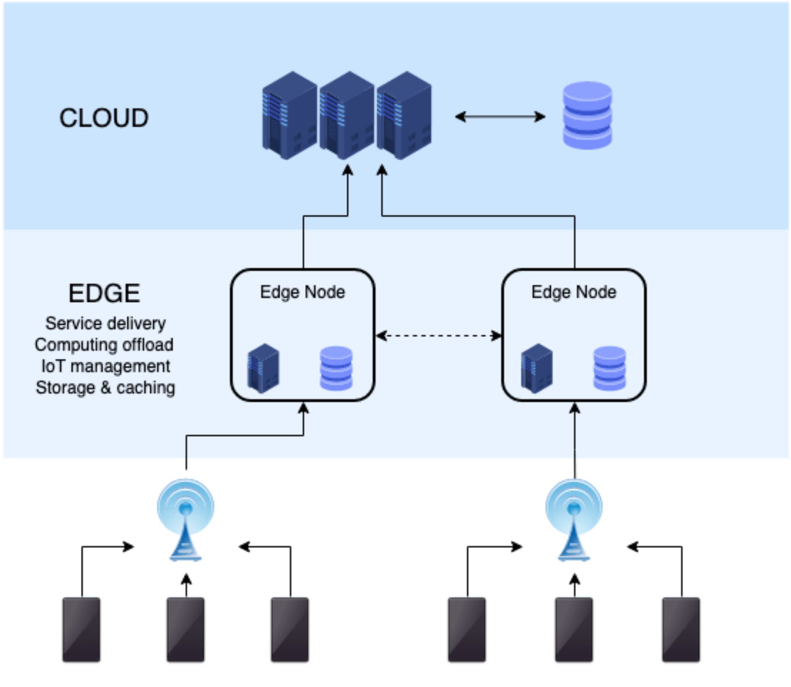
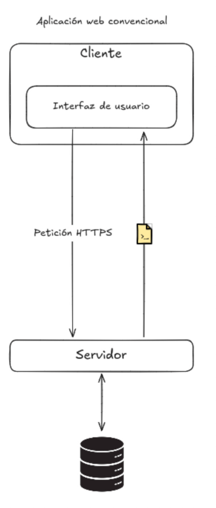
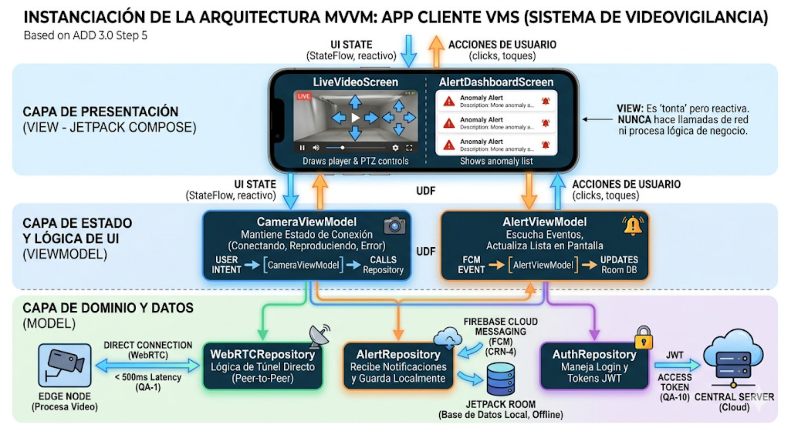

La **Iteración 1** en ADD 3.0 tiene como objetivo principal establecer la estructura general del sistema (marco de referencia arquitectónico) resolviendo los *drivers* más críticos del negocio. Esta versión preserva la organización original por pasos y amplía cada uno con actividades, decisiones, criterios testables y entregables.

---

### Paso 1: Revisar las entradas
Propósito: Consolidar requisitos, casos de uso, atributos de calidad y restricciones que guiarán el diseño.

| Categoría | Detalles |
| :--- | :------ |
| **Propósito del diseño** | Se trata de un sistema de nueva creación (*greenfield*) dentro de un dominio maduro. El propósito es producir un diseño arquitectónico (basado en un modelo *Edge-Cloud*) lo suficientemente detallado para soportar la construcción del sistema, resolviendo problemas críticos como la saturación de red, los altos costos de nube y la dependencia de internet. |
| **Requerimientos funcionales primarios** | • **UC-1 (Visualizar cámaras en tiempo real):** Porque soporta directamente el modelo de negocio core y está fuertemente ligado a problemas técnicos complejos de latencia (QA-1). • **UC-2 (Detectar anomalías):** Porque es el núcleo tecnológico (IA) que resuelve el problema de la fatiga de alarmas (falsos positivos) y cambia el enfoque de reactivo a preventivo. • **UC-6 (Visualizar grabaciones):** Porque es indispensable para el análisis forense post-incidente y está ligado a la restricción de consumo remoto sin depender del almacenamiento del dispositivo cliente (CON-3). |
| **Escenarios de atributos de calidad** | Ver la tabla de escenarios detallada más abajo. |
| **Restricciones** | Todas las restricciones presentadas (**CON-1, CON-2, CON-3**) se incluyen como *drivers*, ya que imponen decisiones innegociables sobre la tecnología de las aplicaciones cliente (Kotlin) y la naturaleza obligatoria del consumo remoto de datos. |
| **Consideraciones arquitectónicas** | Todas las consideraciones arquitectónicas (**CRN-1, CRN-2, CRN-3, CRN-4**) se incluyen como *drivers* para la estructuración de la interfaz y comunicaciones, definiendo el uso de React/Vue, Kotlin Compose con MVVM y Firebase Cloud Messaging. |

<!-- Tabla detallada de escenarios de atributos de calidad -->

### Escenarios de atributos de calidad

Con base en los problemas del negocio, los escenarios se han priorizado de la siguiente manera:

| ID del Escenario | Atributo de calidad (resumen) | Importancia para el Cliente | Dificultad de Implementación |
|---|---|---:|---:|
| **QA-1** | Performance — Latencia E2E < 500 ms | Alta | Alta |
| **QA-2** | Modificabilidad — facilidad para cambiar dispositivos/firmware | Alta | Media |
| **QA-3** | Extensibilidad — agregar sensores/funcionalidades sin reescribir código | Media | Media |
| **QA-4** | Seguridad — Registro y autenticación de dispositivos físicos | Alta | Media |
| **QA-5** | Disponibilidad — Funcionamiento local durante pérdida de red | Alta | Alta |
| **QA-6** | Ligereza — Visualización y reproducción en dispositivos móviles | Baja | Baja |
| **QA-7** | Almacenamiento — Retención y gestión de eventos importantes | Alta | Alta |
| **QA-8** | Adaptabilidad — Operar con cambios en el ambiente físico | Alta | Media |
| **QA-9** | Performance — Minimizar tráfico de red y costos de nube | Alta | Alta |
| **QA-10** | Seguridad — Control de acceso y autenticación de usuarios | Alta | Media |
| **QA-11** | Performance — Procesar información registrada sin afectar rendimiento | Media | Media |
| **QA-12** | Usabilidad — Interfaz intuitiva y eficiencia operativa para usuarios y técnicos | Media | Baja |

### Paso 2: Establecer el objetivo de la iteración (selección de impulsores)

Está primera iteración de un sistema greenfield, el propósito es establecer la arquitectura general del sistema, teniendo en mente todos los drivers y todos los atributos de calidad:

- **QA-1**: Performance
- **QA-5**: Disponibilidad
- **QA-9**: Performance
- **QA-10**: Adaptabilidad
- **CON-1**: Desarrollo Kotlin
- **CON-2**: Aplicación multiplataforma
- **CON-3**: Consumo remoto de bases

---

### Paso 3: Elegir los elementos del sistema a refinar

Debido a que estamos trabajando un sistema greenfield en la primer iteración, el elemento a refinar es el sistema completo.

---

### Paso 4: Elegir los conceptos de diseño
<!--
**Arquitecturas de referencia consideradas**

- **Edge–Cloud (Edge Computing):** Procesamiento local en un nodo Edge para reducir tráfico a la nube, mejorar latencias y permitir funcionamiento autónomo durante cortes de WAN. Trade-off: mayor complejidad en despliegue y gestión de dispositivos, necesidad de almacenamiento y cómputo local.
- **Hub-and-Spoke (Núcleo centralizado con nodos remotos):** Un hub central gestiona control, almacenamiento y coordinación mientras los spokes (Edge/NVR) se conectan a él. Bueno para administración centralizada y consistencia; trade-off: el hub puede convertirse en cuello de botella y punto único de fallo si no se diseñan redundancias.
- **API Gateway / BFF (Backend-for-Frontend):** Capa unificada de entrada que centraliza autenticación, límites de tasa, agregación y adaptación de APIs para clientes móvil/web. Facilita seguridad y evolución de APIs; trade-off: necesita dimensionamiento y alta disponibilidad.
- **Microservicios + Service Mesh:** Servicios desacoplados por dominio con mesh para observabilidad, resiliencia y comunicación segura (mTLS). Escala bien y permite despliegues independientes; trade-off: mayor complejidad operativa y necesidad de experiencia en orquestación.
- **Event-Driven (Broker/Event Sourcing):** Comunicaciones basadas en eventos para desacoplar productores/consumidores (p.ej. Kafka, RabbitMQ). Ideal para sincronización eventual y procesamiento asíncrono; trade-off: modelo mental distinto, latencia eventual y complejidad en garantías de entrega.
- **Serverless / FaaS (Cloud Functions) para ciertos back-ends:** Útil para endpoints esporádicos o procesamiento on-demand (notificaciones, transformaciones). Reduce costos operativos en burst; trade-off: límites de ejecución y frío inicial en cargas continuas de streaming.
- **Monolito modular (MVP rápido):** Aplicación monolítica bien modularizada para acelerar PoC; trade-off: re-arquitecturar luego si se requieren escalados finos.
- **Arquitectura híbrida (Edge + Cloud + CDN/Tiers):** Combinación de patrones arriba para balancear latencia, coste y operabilidad: Edge para IA y grabación local; Cloud para orquestación, analítica histórica y backups.
- **Aplicación nativa con patrón MVVM (referencia arquitectónica):** separación clara entre Vista, Presentación y Modelo; optimizada para rendimiento y control del ciclo de vida. Pros: mejor control de rendimiento y UX; Cons: mayor esfuerzo de mantenimiento por plataforma.
- **Cliente ligero (thin client) con procesamiento fuera del dispositivo:** la aplicación actúa principalmente como interfaz y visualizador; procesamiento/IA se realiza en Edge/Cloud. Pros: actualizaciones de lógica fuera del dispositivo; Cons: dependencia de conectividad y latencia.
- **PWA (Progressive Web App) para dashboard:** habilitar capacidades offline-limitadas y mejoras de responsividad e instalabilidad. Pros: offline resiliente y mejor UX móvil; Cons: no siempre necesario para administradores y añade complejidad.
- **Composición de widgets/embebidos (dashboard as a shell):** Shell que carga widgets autónomos (pueden ser micro-frontends o iframes controlados) para permitir extensibilidad del ecosistema. Pros: extensible y multitenant; Cons: orquestación de comunicaciones y seguridad entre widgets.

- **Autenticación Stateless:** Modelo de autenticación basado en tokens firmados (p. ej. JWT/OAuth2 bearer) donde el servidor no mantiene estado de sesión; permite escalado horizontal de la capa de autenticación y simplifica integración con API Gateway/BFF. Trade-offs: requiere cuidado en caducidad/refresh, revocación y rotación de claves.

- **Store-and-Forward (Almacenamiento y reenvío):** Patrón en el que un nodo intermedio (p. ej. Edge/NVR) almacena temporalmente datos/ eventos cuando la conectividad hacia la nube está degradada y los reenvía cuando la conexión se restablece. Ideal para garantizar disponibilidad local y minimizar tráfico a la nube; trade-offs: requiere mecanismos de persistencia, deduplicación y resolución de conflictos al sincronizar.
-->

### Arquitecturas propuestas seleccionadas

| Arquitectura / Patrón | Por qué se seleccionó |
| :--- | :------ |
| Edge Computing | Reduce latencia E2E y minimiza tráfico de video a la nube, permite grabación y detección local durante cortes de WAN (aborda directamente QA-1, QA-5 y QA-9), soporte para consumo remoto (CON-3) mediante sincronización selectiva. |
| API Gateway / BFF | Centraliza adaptación de APIs para clientes, gestión de seguridad y límites de acceso; facilita cumplimiento de QA-10 (seguridad) y simplifica integración con clientes móviles/web (CON-2, CON-3). |
| MVVM (móvil) | Patrón de referencia para separar UI y lógica de presentación en la app móvil; favorece mantenibilidad, testabilidad y usabilidad (QA-12) y cumple con el requisito de desarrollo móvil (CON-1). |
| SPA (dashboard) | Ofrece experiencia de usuario fluida e interactiva para el panel de administración, facilita visualización en tiempo real y widgets; se integra bien con API Gateway/BFF para adaptar datos al cliente. |
| Autenticación Stateless | Uso de tokens y validación sin sesión en servidor para escalar autenticación (QA-10), simplificar gestión de sesión y facilitar integración con BFF/API Gateway; trade-off: requiere diseño de refresh tokens y rotación segura. |
| Store-and-Forward (Almacenamiento y reenvío) | Permite retención local de eventos y reenvío selectivo hacia Cloud, reduciendo tráfico y garantizando disponibilidad durante cortes WAN; trade-off: añadir persistencia y lógica de reconciliación. |

<!--
| Arquitectura / Patrón | QA-1 | QA-5 | QA-9 | QA-10 | CON-1 | CON-2 | CON-3 | Comentario |
| :--- | :---: | :---: | :---: | :---: | :---: | :---: | :---: | :--- |
| Edge Computing | ✓ | ✓ | ✓ | ~ | ✗ | ✗ | ✓ | Reduce latencia y tráfico; permite disponibilidad local. |
| API Gateway / BFF | ~ | ~ | ~ | ✓ | ✗ | ✓ | ✓ | Acelera seguridad y adaptación de APIs; facilita consumo remoto y soporte multiplataforma. |
| MVVM (móvil) | ~ | ~ | ~ | ~ | ✓ | ✗ | ~ | Patrón que satisface CON-1 y mejora usabilidad/testabilidad (QA-12). |
| SPA (dashboard) | ~ | ~ | ~ | ~ | ✗ | ✓ | ~ | Satisface CON-2 y mejora la usabilidad (QA-12) del dashboard; se apoya en BFF para seguridad y adaptación. |
| Autenticación Stateless | ~ | ~ | ~ | ✓ | ✗ | ✓ | ✓ | Facilita escalado y compatibilidad multiplataforma; mejora seguridad mediante firmas y short-lived tokens, requiere estrategia de refresh/rotación. |
| Store-and-Forward (Almacenamiento y reenvío) | ~ | ✓ | ✓ | ~ | ✗ | ✗ | ✓ | Mejora disponibilidad local (QA-5) y minimiza tráfico a la nube (QA-9); requiere diseño para sincronización y deduplicación. |
-->

### Arquitecturas propuestas no seleccionadas

| Arquitectura / Patrón | Por qué no se seleccionó  |
| :--- | :------ |
| Hub-and-Spoke | Centraliza datos/control; aumenta riesgo de punto único de fallo y requiere inversión en redundancia antes de ser apropiado. |
| Microservicios + Service Mesh | Requiere madurez operativa (observabilidad, orquestación); se pospone hasta validar carga y necesidades de despliegue independiente. |
| Event-Driven (Broker) | Añade consistencia eventual y complejidad en garantías; útil para procesos asíncronos, no prioritario para primer PoC que necesita latencia determinista. |
| Serverless / FaaS | No apto para cargas de streaming continuo; considerado para funciones auxiliares (transformaciones, notificaciones) posteriormente. |
| Monolito modular | Útil para prototipos rápidos, pero no resuelve drivers críticos de latencia y disponibilidad a escala. |
| SSR (Server-Side Rendering) para dashboard | Mejora primer paint/SEO pero añade complejidad infra; no prioritario para panel administrativo interno. |
| PWA (dashboard) | Añade offline y mejora UX móvil; no es requisito crítico para la iteración inicial del panel. |
| Micro-frontends | Permite despliegue por equipo, pero añade complejidad de integración que retrasaría entregables tempranos. |
| Widgets / Shell | Extensible, pero orquestación e integración segura entre widgets es trabajo adicional no crítico ahora. |
| Thin client (móvil) | Depende fuertemente de Edge/Cloud para procesamiento; incumpliría QA-1 en escenarios de latencia estricta. |
| Local-first / Offline-first (móvil) | Muy valioso para resiliencia (QA-5) pero complica la sincronización; requiere diseñar estrategias de resolución de conflictos. |
| Feature modules (móvil) | Buena práctica para organización, no es una alternativa arquitectónica que resuelva drivers por sí misma; se adoptará dentro de la implementación. |
| Streaming/reactive client (móvil) | Cumple QA-1 pero implica mayor esfuerzo de pruebas y control de recursos; se puede incorporar como mejora del cliente en la misma iteración si deciden priorizarlo. |
| Shell + plugins (móvil) | Extensible y adaptativo, pero añade complejidad de seguridad y compatibilidad que queda para futuras iteraciones. |

<!--
La tabla siguiente marca con ✓ (cumple), ~ (parcial) o ✗ (no cumple) cómo cada arquitectura propuesta contribuye a los drivers de la iteración inicial.

| Arquitectura / Patrón | QA-1 | QA-5 | QA-9 | QA-10 | CON-1 | CON-2 | CON-3 | Comentario |
| :--- | :---: | :---: | :---: | :---: | :---: | :---: | :---: | :--- |
| Hub-and-Spoke | ~ | ~ | ~ | ~ | ✗ | ✗ | ~ | Centralización facilita control, pero puede afectar latencia y disponibilidad sin redundancia. |
| Microservicios + Service Mesh | ~ | ✓ | ~ | ✓ | ✗ | ✗ | ~ | Escala resiliente y seguridad; overhead operativo. |
| Event-Driven | ~ | ✓ | ✓ | ~ | ✗ | ✗ | ~ | Reduce tráfico síncrono y mejora desacoplo; introduce eventual consistency. |
| Serverless / FaaS | ✗ | ~ | ~ | ~ | ✗ | ✗ | ~ | Adecuado para cargas event-driven, no para streaming con QA-1. |
| Monolito modular | ~ | ~ | ~ | ~ | ✗ | ✗ | ~ | Rápido para PoC, limitado para drivers críticos de latencia/disponibilidad. |
| SSR (dashboard) | ~ | ~ | ~ | ~ | ✗ | ✓ | ~ | Mejora primer paint (UX), pero no impacta latencia de video ni disponibilidad Edge. |
| PWA (dashboard) | ~ | ✓ | ~ | ~ | ✗ | ✓ | ~ | Ofrece offline parcial y mejor experiencia móvil; no prioritaria. |
| Micro-frontends | ~ | ~ | ~ | ~ | ✗ | ✓ | ~ | Facilita despliegue por equipo; no resuelve latencia por sí misma. |
| Widgets / Shell | ~ | ~ | ~ | ~ | ✗ | ✓ | ~ | Extensible, pero requiere trabajo de integración/seguridad. |
| Thin client (móvil) | ✗ | ✗ | ✗ | ~ | ✓ | ✗ | ✓ | Depende de Edge/Cloud; riesgo sobre QA-1. |
| Local-first / Offline-first (móvil) | ~ | ✓ | ✓ | ~ | ✓ | ✗ | ✓ | Resiliente a desconexiones; complejidad en sincronización. |
| Feature modules (móvil) | ~ | ~ | ~ | ~ | ✓ | ✗ | ~ | Mejora organización/entrega pero no es una solución arquitectónica principal. |
| Streaming/reactive client (móvil) | ✓ | ~ | ~ | ~ | ✓ | ✗ | ~ | Cumple QA-1; requiere esfuerzo en pruebas y optimización. |
| Shell + plugins (móvil) | ~ | ~ | ~ | ~ | ✓ | ✗ | ~ | Extensible, futura opción para ecosistema de capacidades.
-->

### Diagramas
 

{fig-cap="Figura 1: Despliegue" width="600px" fig-alt="Diagrama de despliegue"}

 

{fig-cap="Figura 2: Modelo Vista Vista-Modelo" width="600px" fig-alt="Diagrama de modelo vista vista-modelo"}

 

{fig-cap="Figura 3: Patrón Single Page Application" width="350px" fig-alt="Diagrama de patrón Single Page Application"}

### Paso 5: Instanciar elementos arquitectónicos y asignar responsabilidades

En este paso se instanciarán los elementos arquitectónicos seleccionados en Paso 4 y se asignarán responsabilidades, contratos y criterios de prueba para cada componente.

 

{fig-cap="Figura 4: Patrón SPA Instanciado" width="700px" fig-alt="Diagrama de patrón Single Page Application Instanciado"}

 

{fig-cap="Figura 5: Patrón MVVM Instanciado" width="700px" fig-alt="Diagrama de patrón MVVM Instanciado"}

---

### Paso 6: Bosquejar vistas y registrar decisiones (ADR)
Propósito: Formalizar las decisiones arquitectónicas y justificar trade-offs.

Formato mínimo ADR por decisión:
- ID: DEC-X
- Contexto: problema que motiva la decisión.
- Decisión: qué se adopta.
- Consecuencias: impacto positivo y negativo.
- Alternativas consideradas.

Ejemplos resumidos:
- DEC-1: Adoptar Edge–Cloud (contexto: reducir tráfico y tolerar desconexiones).
- DEC-2: Ejecutar IA en Edge (contexto: reducir falsos positivos y latencia).
- DEC-3: WebRTC + TURN/STUN (contexto: latencia y NAT traversal).

Salida:
- Colección de ADRs en /docs/adr/ con referencias a UC y QA.

---

### Paso 7: Analizar el diseño respecto al objetivo y definir pruebas
Propósito: Verificar que las decisiones cumplen los objetivos y definir cómo probarlo.

Actividades:
- Definir escenarios de prueba para cada criterio de aceptación.
- Crear scripts/sensores para medir latencia y consumo de banda.
- Definir umbrales de éxito y summar report.

Escenarios de prueba (ejemplos):
- SP-1 (Latencia LAN): Cliente móvil en LAN se conecta a Edge via WebRTC; medir E2E 100 muestras.
- SP-2 (Uso normal vs evento): Simular 10 cámaras; medir volumen enviado a Cloud en operación continua vs solo eventos (1 día).
- SP-3 (Desconexión): Cortar WAN por 2 horas; verificar grabación local continúa y sincronización en < 10 minutos tras restablecer.

Resultados esperados y métricas:
- Latencia E2E < 500 ms en 90% de muestras (SP-1).
- Volumen a la nube < 10% del video total (SP-2).
- Sincronización de eventos críticos < 10 minutos (SP-3).

Riesgos transversales y mitigaciones (resumen):
- Capacidad Edge insuficiente → modelos optimizados, aceleradores.
- WebRTC no cumple en condiciones móviles reales → ajustes de códec, fallback HLS.
- Escalado de TURN/STUN → plan de dimensionamiento y uso de proveedores.

Entregables finales de la iteración:
- Documento `primer_iteracion.qmd` (actualizado, con pasos detallados).
- ADRs en `/docs/adr/`.
- Diagrama de despliegue y flujo de datos.
- Scripts de prueba para latencia y ancho de banda (básico).

### Tablas de alternativas descartadas

**Alternativas descartadas para la Arquitectura física (Edge–Cloud)**

| Alternativa | Razón para descartar |
| :--- | :--- |
| Arquitectura puramente Cloud (Nube centralizada) | Transmitir video de alta resolución 24/7 desde decenas de cámaras a la nube saturaría el ancho de banda del cliente y generaría costos de almacenamiento exorbitantes; vulnera QA-9 y QA-5. |

**Alternativas descartadas para la arquitectura del servidor**

| Alternativa | Razón para descartar |
| :--- | :--- |
| Arquitectura Monolítica | Más simple para iniciar, pero dificulta escalar independientemente servicios críticos (streaming, notificaciones, IA), comprometiendo rendimiento y flexibilidad futura. |

**Alternativas descartadas para la arquitectura cliente**

| Alternativa | Razón para descartar |
| :--- | :--- |
| Aplicación de Cliente Rico (Desktop) | Requiere instalación local, contradice el acceso ágil y remoto vía navegadores web multiplataforma (CON-2). |

**Alternativas descartadas para la capa de comunicación**

| Alternativa | Razón para descartar |
| :--- | :--- |
| HLS (HTTP Live Streaming) | Introduce latencias de 3–10s por segmentación, incumpliendo el requisito de latencia crítica (QA-1). |

