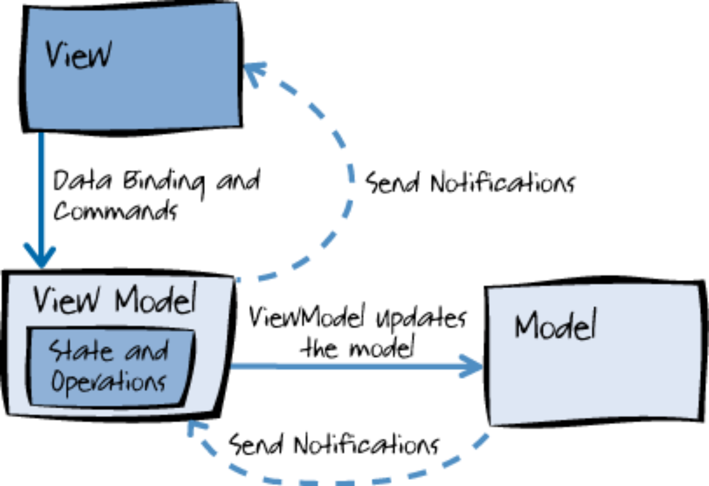
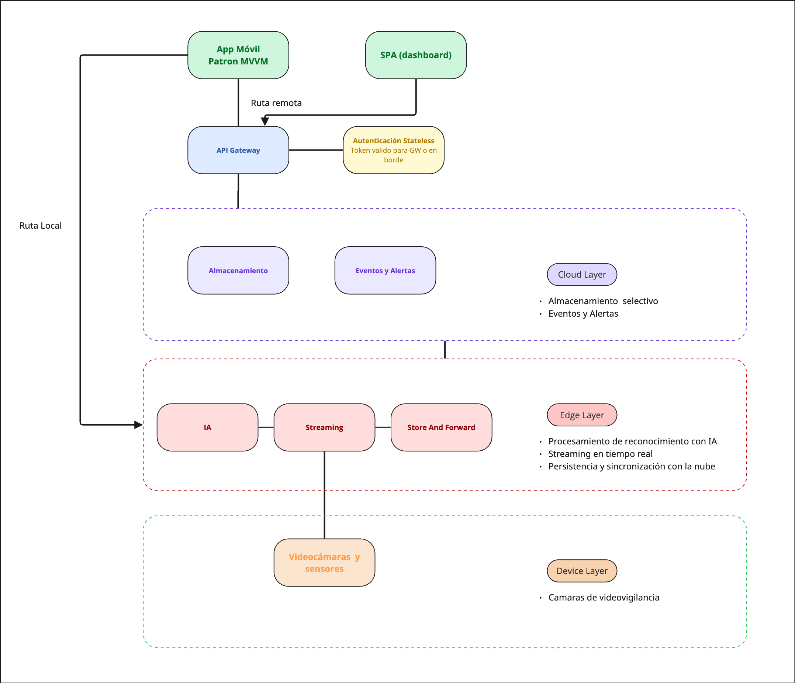
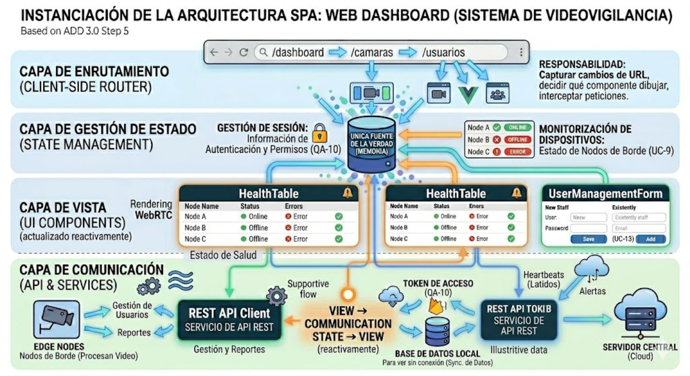
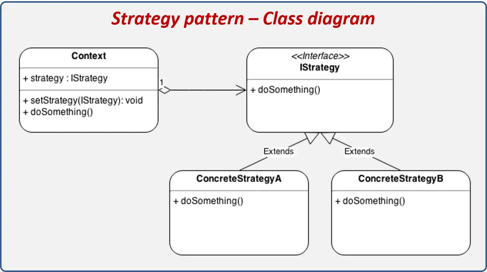
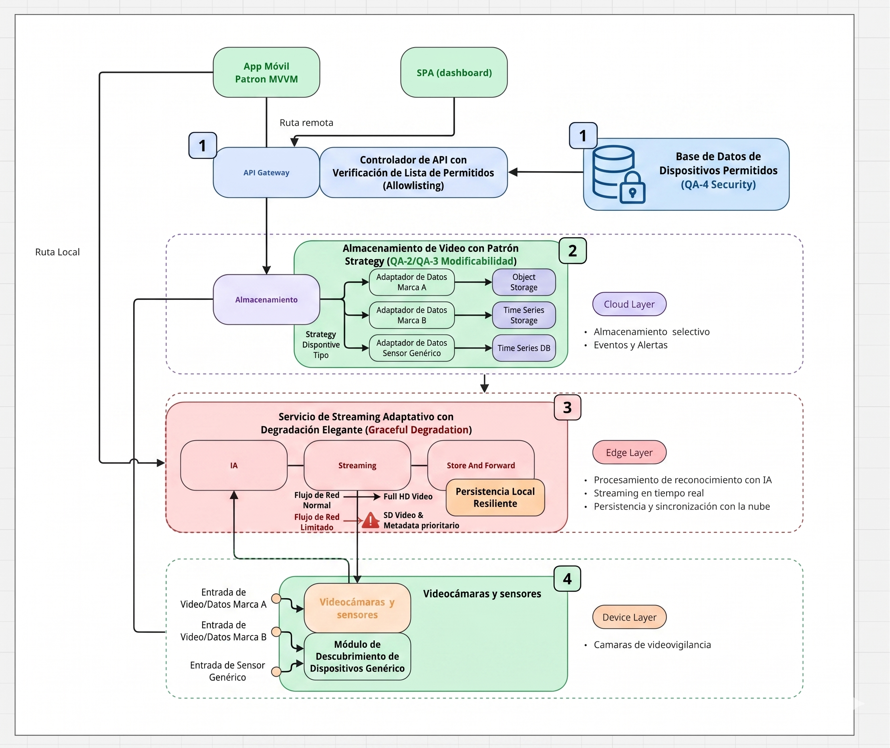
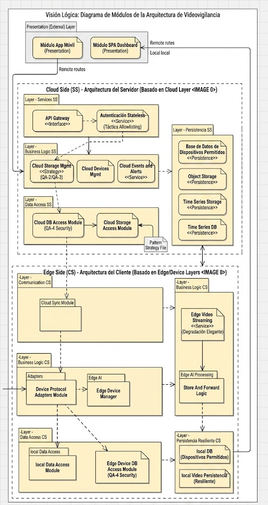
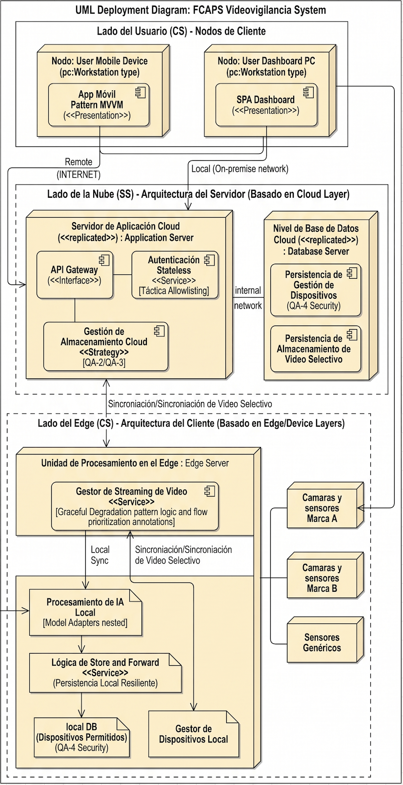

\thispagestyle{empty}
\begin{center}
\textsc{Centro de Investigación y de Estudios Avanzados}\\[0.5cm]
\textsc{Maestría en Ciencias de la Computación}\\[2cm]
\begin{center}
\huge\bfseries Arquitectura de software de referencia para el desarrollo de sistemas de videovigilancia inteligentes
\end{center}

\vspace{2cm}
{\Large \textbf{Alumnos}}\\[0.3cm]
{\normalsize \textbf{Moisés Alejandro Sánchez Vergara}}\\[0.3cm]
{\normalsize \textbf{Edgar Tobón Sosa}}\\[0.5cm]
{\Large \textbf{Profesor}}\\[0.3cm]
{\normalsize \textbf{Dr. Eduardo López Domínguez}}\\[2cm]
14 de abril 2026
\end{center}

\newpage

# Iteración 1: Establecer la arquitectura base

La **Iteración 1** en ADD 3.0 tiene como objetivo principal establecer la estructura general del sistema (marco de referencia arquitectónico) resolviendo los *drivers* más críticos del negocio. Esta versión preserva la organización original por pasos y amplía cada uno con actividades, decisiones, criterios testables y entregables.

### Paso 1: Revisar las entradas
Propósito: Consolidar requisitos, casos de uso, atributos de calidad y restricciones que guiarán el diseño.

| Categoría | Detalles |
| :--- | :------ |
| **Propósito del diseño** | Se trata de un sistema de nueva creación (*greenfield*) dentro de un dominio maduro. El propósito es producir un diseño arquitectónico (basado en un modelo *Edge-Cloud*) lo suficientemente detallado para soportar la construcción del sistema, resolviendo problemas críticos como la saturación de red, los altos costos de nube y la dependencia de internet. |
| **Requerimientos funcionales primarios** | • **UC-1 (Visualizar cámaras en tiempo real):** Porque soporta directamente el modelo de negocio core y está fuertemente ligado a problemas técnicos complejos de latencia (QA-1). • **UC-2 (Detectar anomalías):** Porque es el núcleo tecnológico (IA) que resuelve el problema de la fatiga de alarmas (falsos positivos) y cambia el enfoque de reactivo a preventivo. • **UC-6 (Visualizar grabaciones):** Porque es indispensable para el análisis forense post-incidente y está ligado a la restricción de consumo remoto sin depender del almacenamiento del dispositivo cliente (CON-3). |
| **Escenarios de atributos de calidad** | Ver la tabla de escenarios detallada más abajo. |
| **Restricciones** | Todas las restricciones presentadas (**CON-1, CON-2, CON-3**) se incluyen como *drivers*, ya que imponen decisiones innegociables sobre la tecnología de las aplicaciones cliente (Kotlin) y la naturaleza obligatoria del consumo remoto de datos. |
| **Consideraciones arquitectónicas** | Todas las consideraciones arquitectónicas (**CRN-1, CRN-2, CRN-3, CRN-4**) se incluyen como *drivers* para la estructuración de la interfaz y comunicaciones, definiendo el uso de React/Vue, Kotlin Compose con MVVM y Firebase Cloud Messaging. |

<!-- Tabla detallada de escenarios de atributos de calidad -->

### Escenarios de atributos de calidad

Con base en los problemas del negocio, los escenarios se han priorizado de la siguiente manera:

| ID del Escenario | Atributo de calidad (resumen) | Importancia para el Cliente | Dificultad de Implementación |
|---|---|---:|---:|
| **QA-1** | Performance — Latencia E2E < 500 ms | Alta | Alta |
| **QA-2** | Modificabilidad — facilidad para cambiar dispositivos/firmware | Alta | Media |
| **QA-3** | Extensibilidad — agregar sensores/funcionalidades sin reescribir código | Media | Media |
| **QA-4** | Seguridad — Registro y autenticación de dispositivos físicos | Alta | Media |
| **QA-5** | Disponibilidad — Funcionamiento local durante pérdida de red | Alta | Alta |
| **QA-6** | Ligereza — Visualización y reproducción en dispositivos móviles | Baja | Baja |
| **QA-7** | Almacenamiento — Retención y gestión de eventos importantes | Alta | Alta |
| **QA-8** | Adaptabilidad — Operar con cambios en el ambiente físico | Alta | Media |
| **QA-9** | Performance — Minimizar tráfico de red y costos de nube | Alta | Alta |
| **QA-10** | Seguridad — Control de acceso y autenticación de usuarios | Alta | Media |
| **QA-11** | Performance — Procesar información registrada sin afectar rendimiento | Media | Media |
| **QA-12** | Usabilidad — Interfaz intuitiva y eficiencia operativa para usuarios y técnicos | Media | Baja |

### Paso 2: Establecer el objetivo de la iteración (selección de impulsores)

Está primera iteración de un sistema greenfield, el propósito es establecer la arquitectura general del sistema, teniendo en mente todos los drivers y todos los atributos de calidad:

- **QA-1**: Performance
- **QA-5**: Disponibilidad
- **QA-9**: Performance
- **QA-10**: Adaptabilidad
- **CON-1**: Desarrollo Kotlin
- **CON-2**: Aplicación multiplataforma
- **CON-3**: Consumo remoto de bases

### Paso 3: Elegir los elementos del sistema a refinar

Debido a que estamos trabajando un sistema greenfield en la primer iteración, el elemento a refinar es el sistema completo.

### Paso 4: Elegir los conceptos de diseño

### Arquitecturas propuestas seleccionadas

| Arquitectura / Patrón | Por qué se seleccionó |
| :--- | :------ |
| Edge Computing | Reduce latencia E2E y minimiza tráfico de video a la nube, permite grabación y detección local durante cortes de WAN (aborda directamente QA-1, QA-5 y QA-9), soporte para consumo remoto (CON-3) mediante sincronización selectiva. |
| API Gateway / BFF | Centraliza adaptación de APIs para clientes, gestión de seguridad y límites de acceso; facilita cumplimiento de QA-10 (seguridad) y simplifica integración con clientes móviles/web (CON-2, CON-3). |
| MVVM (móvil) | Patrón de referencia para separar UI y lógica de presentación en la app móvil; favorece mantenibilidad, testabilidad y usabilidad (QA-12) y cumple con el requisito de desarrollo móvil (CON-1). |
| SPA (dashboard) | Ofrece experiencia de usuario fluida e interactiva para el panel de administración, facilita visualización en tiempo real y widgets; se integra bien con API Gateway/BFF para adaptar datos al cliente. |
| Autenticación Stateless | Uso de tokens y validación sin sesión en servidor para escalar autenticación (QA-10), simplificar gestión de sesión y facilitar integración con BFF/API Gateway; trade-off: requiere diseño de refresh tokens y rotación segura. |
| Store-and-Forward (Almacenamiento y reenvío) | Permite retención local de eventos y reenvío selectivo hacia Cloud, reduciendo tráfico y garantizando disponibilidad durante cortes WAN; trade-off: añadir persistencia y lógica de reconciliación. |

<!--
| Arquitectura / Patrón | QA-1 | QA-5 | QA-9 | QA-10 | CON-1 | CON-2 | CON-3 | Comentario |
| :--- | :---: | :---: | :---: | :---: | :---: | :---: | :---: | :--- |
| Edge Computing | ✓ | ✓ | ✓ | ~ | ✗ | ✗ | ✓ | Reduce latencia y tráfico; permite disponibilidad local. |
| API Gateway / BFF | ~ | ~ | ~ | ✓ | ✗ | ✓ | ✓ | Acelera seguridad y adaptación de APIs; facilita consumo remoto y soporte multiplataforma. |
| MVVM (móvil) | ~ | ~ | ~ | ~ | ✓ | ✗ | ~ | Patrón que satisface CON-1 y mejora usabilidad/testabilidad (QA-12). |
| SPA (dashboard) | ~ | ~ | ~ | ~ | ✗ | ✓ | ~ | Satisface CON-2 y mejora la usabilidad (QA-12) del dashboard; se apoya en BFF para seguridad y adaptación. |
| Autenticación Stateless | ~ | ~ | ~ | ✓ | ✗ | ✓ | ✓ | Facilita escalado y compatibilidad multiplataforma; mejora seguridad mediante firmas y short-lived tokens, requiere estrategia de refresh/rotación. |
| Store-and-Forward (Almacenamiento y reenvío) | ~ | ✓ | ✓ | ~ | ✗ | ✗ | ✓ | Mejora disponibilidad local (QA-5) y minimiza tráfico a la nube (QA-9); requiere diseño para sincronización y deduplicación. |
-->

### Arquitecturas propuestas no seleccionadas

| Arquitectura / Patrón | Por qué no se seleccionó  |
| :--- | :------ |
| Hub-and-Spoke | Centraliza datos/control; aumenta riesgo de punto único de fallo y requiere inversión en redundancia antes de ser apropiado. |
| Microservicios + Service Mesh | Requiere madurez operativa (observabilidad, orquestación); se pospone hasta validar carga y necesidades de despliegue independiente. |
| Event-Driven (Broker) | Añade consistencia eventual y complejidad en garantías; útil para procesos asíncronos, no prioritario para primer PoC que necesita latencia determinista. |
| Serverless / FaaS | No apto para cargas de streaming continuo; considerado para funciones auxiliares (transformaciones, notificaciones) posteriormente. |
| Monolito modular | Útil para prototipos rápidos, pero no resuelve drivers críticos de latencia y disponibilidad a escala. |
| SSR (Server-Side Rendering) para dashboard | Mejora primer paint/SEO pero añade complejidad infra; no prioritario para panel administrativo interno. |
| PWA (dashboard) | Añade offline y mejora UX móvil; no es requisito crítico para la iteración inicial del panel. |
| Micro-frontends | Permite despliegue por equipo, pero añade complejidad de integración que retrasaría entregables tempranos. |
| Widgets / Shell | Extensible, pero orquestación e integración segura entre widgets es trabajo adicional no crítico ahora. |
| Thin client (móvil) | Depende fuertemente de Edge/Cloud para procesamiento; incumpliría QA-1 en escenarios de latencia estricta. |
| Local-first / Offline-first (móvil) | Muy valioso para resiliencia (QA-5) pero complica la sincronización; requiere diseñar estrategias de resolución de conflictos. |
| Feature modules (móvil) | Buena práctica para organización, no es una alternativa arquitectónica que resuelva drivers por sí misma; se adoptará dentro de la implementación. |
| Streaming/reactive client (móvil) | Cumple QA-1 pero implica mayor esfuerzo de pruebas y control de recursos; se puede incorporar como mejora del cliente en la misma iteración si deciden priorizarlo. |
| Shell + plugins (móvil) | Extensible y adaptativo, pero añade complejidad de seguridad y compatibilidad que queda para futuras iteraciones. |

### Diagramas
 

{fig-cap="Figura 1: Despliegue" width="500px" fig-alt="Diagrama de despliegue"}

 

{fig-cap="Figura 2: Modelo Vista Vista-Modelo" width="500px" fig-alt="Diagrama de modelo vista vista-modelo"}

 

{fig-cap="Figura 3: Patrón Single Page Application" width="300px" fig-alt="Diagrama de patrón Single Page Application"}

### Paso 5: Instanciar elementos arquitectónicos y asignar responsabilidades

| Módulo / Elemento Instanciado | Responsabilidades Asignadas | Origen (Concepto de Diseño) |
| :--- | :------ | :--- |
| **Servidor NVR / Nodo Edge** | • **Ingesta de Video:** Capturar y procesar de forma continua el flujo RTSP de las cámaras locales. • **Procesamiento AI Local:** Ejecutar los modelos de visión computacional para la detección de anomalías en tiempo real sin enviar video a la nube. • **Store-and-Forward:** Sincronización selectiva en la nube. | Edge Computing |
| **API Gateway Central** | • **Punto de Entrada Único:** Recibir absolutamente todas las peticiones entrantes desde la App Móvil y el Dashboard Web. • **Enrutamiento:** Redirigir la petición al microservicio interno correspondiente (Dispositivos, Eventos, Notificaciones). | API Gateway |
| **Servicio de Identidad (Auth)** | **Validación Stateless:** Verificar la firma criptográfica de los tokens en cada petición entrante, confirmando roles y permisos sin necesidad de consultar la base de datos o guardar sesiones en la memoria del servidor. | Autenticación Stateless |
| **Cliente Móvil (Capas View, ViewModel, Model)** | • **Capa Repository:** Se encarga de gestionar la lógica de acceso a datos y comunicación con el Nodo Edge. | Arquitectura MVVM |
| **Dashboard Web (Router, State Store, Componentes)** | • **Router Cliente:** Manejar la navegación entre pantallas (Panel de salud, visualización, usuarios) sin recargar la página en el navegador. • **State Store:** Mantener en memoria RAM del navegador el estado "en vivo" de los Nodos Edge (Online/Offline) para no saturar el servidor con peticiones redundantes. • **Componentes UI:** Renderizar los *videowalls* reactivos que se actualizan automáticamente ante cambios en el Store global. | Patrón SPA (Single Page Application) |

### Paso 6: Bosquejar vistas y registrar decisiones (ADR)

### Edge Computing 

| Elemento | Descripción / Responsabilidades |
| :--- | :----- |
| **Device Layer** | Captura los datos con la cámara de videovigilancia y se comunica con la capa Edge. |
| **Edge Layer** | Recolecta la información de las cámaras de videovigilancia en tiempo real y se comunica con la capa Cloud |
| **Cloud Layer** | Almacena y procesa los datos recibidos desde la capa Edge, proporcionando servicios centralizados y análisis avanzados. |
| **Videocamara y sensores** | Se encargan de capturar la información en tiempo real para transmitir la información a la capa Edge. |
| **IA** | Se encarga de realizar el procesamiento de la información para el reconocmiento de personas. |
| **Streaming** | Expone el endpoint para poder visualizar en tiempo real el video de las cámaras de videovigilancia. |
| **Store and Foreward** | Se encarga de persisitir las grabaciones y sinconizar la información selectiva hacia la capa Cloud. |
| **Almacenamiento** | Persiste en la nube la información selectiva y el Dashboard para gestionar el sistema. |
| **Eventos y alertas** | Esta capa se encarga de enviar notificaciones hacia la aplicación móvil. |
| **API Gateway** | Actua como punto de entrada único, recibiendo las solicitudes de entrada web y móbil |
| **Autenticación Stateless** | Método de autenticación. |
| **Spa (Dashboard)** | Aplicación multiplataforma para gestión del sistema. |
| **App móvil** | Aplicación móvil para monitoreo del sistema de videovigilancia. |

 

{fig-cap="Figura 4: Arquitectura Edge Computing instanciada" width="500px" fig-alt="Diagrama de arquitectura Edge Computing instanciada"}

 

### MVVM

| Elemento | Descripción |
| :--- | :--- |
| **View (UI)** | Interfaz que renderiza video, controles y alertas. |
| **ViewModel** | Orquesta estado reactivo, reconexiones y coordina repositorios. |
| **Repositories** / Model | Acceso y persistencia local (DB, cache y cola Store-and-Forward); sincronización con BFF y manejo de datos offline. |
| **API Gateway** | Maneja tokens, refresh y permisos; almacenamiento seguro de credenciales y aplicación de políticas de acceso. |
| **Notificaciones** | Se recibe notificación cuando el sistema de alertamiento las arroja. |

 

{width="500px" fig-alt="Diagrama de patrón MVVM Instanciado"}

 

### SPA 

| Elemento | Descripción |
| :--- | :--- |
| Router (Client-side) | Maneja navegación sin recargas, protección de rutas y carga diferida de módulos. |
| State Store (Global) | Mantiene el estado en vivo (health, sesiones, videowalls) y sincroniza con BFF mediante sockets/streaming. |
| UI Components / Videowalls | Componentes reutilizables para renderizar streams y controles, con fallback y optimizaciones de rendimiento. |
| API Client / BFF Consumer | Orquesta llamadas al BFF, caching y políticas de retry/backoff; alimenta el State Store. |
| Auth / Session Management | Valida y renueva tokens en cliente, aplica roles y maneja expiraciones de forma segura. |

 

{width="500px" fig-alt="Diagrama de patrón Single Page Application Instanciado"}

 

### Paso 7: Analizar el diseño respecto al objetivo y definir pruebas

**Objetivo inicial de la iteración:** Establecer la estructura física y lógica general del sistema (Arquitectura Base) para soportar streaming de ultra baja latencia, procesamiento preventivo y operación resiliente ante caídas de red, cumpliendo con las restricciones tecnológicas del equipo.

**Resultado de la evaluación:** El objetivo se **cumplió satisfactoriamente**. La decisión de adoptar una arquitectura Edge-Cloud estructurada delegó la carga pesada al borde de la red, resolviendo de raíz el problema de saturación y los costos de nube, mientras que la introducción de WebRTC garantizó el cumplimiento de las metas de rendimiento.

 

| Not addressed | Partially addressed | Completely addressed | Design decisions made during the iteration |
| :---: | :---: | :---: | :----- |
| | **UC-1** | |La arquitectura de referencia seleccionada soporta está funcionalidad |
| | **UC-2** | | La arquitectura de referencia seleccionada soporta está funcionalidad |
| | **UC-3** | | La arquitectura de referencia seleccionada soporta está funcionalidad |
| **UC-4** | | | No se tomaron decisiones relevantes, ya que es necesario identificar los elementos que participan en el caso de uso asociado al escenario.|
| **UC-5** | | | No se tomaron decisiones relevantes, ya que es necesario identificar los elementos que participan en el caso de uso asociado al escenario.|
| | **UC-6** | | La arquitectura de referencia seleccionada soporta está funcionalidad. |
| **UC-7** | | | No se tomaron decisiones relevantes, ya que es necesario identificar los elementos que participan en el caso de uso asociado al escenario.|
| | **UC-8** | | La arquitectura de referencia seleccionada soporta está funcionalidad. |
| **UC-9** | | | No se tomaron decisiones relevantes, ya que es necesario identificar los elementos que participan en el caso de uso asociado al escenario.|
| | **UC-10** | | La arquitectura de referencia seleccionada soporta está funcionalidad. |
| | **UC-11** | | La arquitectura de referencia seleccionada soporta está funcionalidad. |
| **UC-12** | | | No se tomaron decisiones relevantes, ya que es necesario identificar los elementos que participan en el caso de uso asociado al escenario.|
| **UC-13** | | | No se tomaron decisiones relevantes, ya que es necesario identificar los elementos que participan en el caso de uso asociado al escenario.|
| **UC-14** | | | No se tomaron decisiones relevantes, ya que es necesario identificar los elementos que participan en el caso de uso asociado al escenario.|
| | **UC-15** | | La arquitectura de referencia seleccionada soporta está funcionalidad. |
| | **QA-1** | | La arquitectura de referencia seleccionada soporta está funcionalidad.|
| **QA-2** | | | No se tomaron decisiones relevantes, ya que es necesario identificar los elementos que participan en el caso de uso asociado al escenario.|
| **QA-3** | | | No se tomaron decisiones relevantes, ya que es necesario identificar los elementos que participan en el caso de uso asociado al escenario.|
| **QA-4** | | | No se tomaron decisiones relevantes, ya que es necesario identificar los elementos que participan en el caso de uso asociado al escenario.|
| | **QA-5** | | La arquitectura de referencia seleccionada soporta está funcionalidad. |
| | **QA-6** | | La arquitectura de referencia seleccionada soporta está funcionalidad. |
| | **QA-7** | | La arquitectura de referencia seleccionada soporta está funcionalidad. |
| **QA-8** | | | No se tomaron decisiones relevantes, ya que es necesario identificar los elementos que participan en el caso de uso asociado al escenario.|
| | **QA-9** | | La arquitectura de referencia seleccionada soporta está funcionalidad. |
| | **QA-10** | | La arquitectura de referencia seleccionada soporta está funcionalidad. |
| | **QA-11** | | La arquitectura de referencia seleccionada soporta está funcionalidad. |
| | **CRN-1** | | La estructura general lógica del sistema ha sido establecida, pero la estructura física aún no ha sido definida. |
| **CRN-2** | | | No se tomaron decisiones relevantes, ya que es necesario identificar los elementos que participan en el caso de uso asociado al escenario.|
| | **CRN-3** | | La arquitectura de referencia seleccionada soporta está funcionalidad. |
| **CRN-4** | | | No se tomaron decisiones relevantes, ya que es necesario identificar los elementos que participan en el caso de uso asociado al escenario.|
| **CON-1** | | | No se tomaron decisiones relevantes, ya que es necesario identificar los elementos que participan en el caso de uso asociado al escenario.|
| | **CON-2** | | La arquitectura de referencia seleccionada soporta está funcionalidad. |
| | **CON-3** | | La arquitectura de referencia seleccionada soporta está funcionalidad. |

\newpage

# Iteración 2: Refinar la arquitectura para soportar nuevos drivers

### Paso 2: Establecer el objetivo de la iteración (selección de impulsores)
El objetivo de esta iteración es detallar las interfaces de comunicación y los mecanismos de control de acceso para garantizar la extensibilidad del sistema frente a nuevos dispositivos, asegurar la adaptabilidad operativa en entornos de red inestables y robustecer la seguridad en la frontera mediante la validación de identidades autorizadas.

- **QA-2**: Modificabilidad
- **QA-3**: Extensibilidad
- **QA-4**: Seguridad
- **QA-8**: Adaptabilidad

### Paso 3: Elegir los elementos del sistema a refinar

A partir de la arquitectura de referencia establecida en la primera iteración, se han identificado los siguientes elementos arquitectónicos que requieren refinamiento y descomposición para satisfacer los escenarios de extensibilidad, adaptación y seguridad seleccionados:

* **El Nodo de Procesamiento Local (Edge Computing Node):**

    Es el elemento más crítico para esta iteración. Requiere refinamiento para soportar la Extensibilidad (debe diseñarse para aceptar nuevos modelos de cámaras sin alterar la lógica central), la Adaptación (debe implementar la lógica de Store-and-Forward para gestionar las pérdidas de red) y la Seguridad (debe incorporar el submódulo de validación de tokens Stateless para la ruta local).

* **El Cliente Ligero (App Móvil / SPA):**

    Requiere refinamiento interno para soportar la Adaptación. El cliente debe evolucionar de ser un simple visor a un componente inteligente capaz de detectar el contexto de red (LAN vs. WAN) y decidir dinámicamente qué ruta de conexión o endpoint utilizar.

* **El API Gateway (Frontera de la Nube):**

    Aunque se introdujo conceptualmente en la primera iteración, debe refinarse en esta etapa para formalizar su responsabilidad en la Seguridad, específicamente como el emisor y validador remoto de los artefactos de identidad autocontenidos (Tokens Stateless), controlando el acceso de los dispositivos autorizados.

\newpage

### Paso 4: Elegir los conceptos de diseño

| Arquitectura / Patrón| Por qué se seleccionó|
| :--- | :------ |
| **Patrón Strategy / Adapter**  |  Implementas un "Adaptador" para cada marca o modelo. Cuando agregas una cámara nueva de otra marca, solo creas un archivo de configuración o un pequeño plugin, pero el 0% del código central (el que procesa la IA o guarda el video) se toca. |
| **Táctica de Lista de Permitidos (Allowlisting)** | El API Gateway o un servicio de "Provisionamiento" debe gestionar una base de datos de IDs únicos (como la dirección MAC o un número de serie firmado). |
| **Degradación elegante (Graceful Degradation)** |  El sistema identifica qué funciones son críticas y cuáles son secundarias. Ante un cambio de ambiente (pérdida de WAN, fallo de un sensor, caída de la nube), suspende las funciones secundarias y garantiza que las críticas —grabación local, detección, alarmas— sigan operando. Esto complementa el Store-and-Forward de la primera iteración dándole una política de decisión explícita. |

### Diagramas
 

{fig-cap="Figura 1: Despliegue" width="500px" fig-alt="Diagrama de Patrón Strategy /Adapter"}

### Paso 5: Instanciar elementos arquitectónicos y asignar responsabilidades

| Concepto de Diseño | Elementos Instanciados | Responsabilidades |
| :--- | :---- | :----- |
| **Patrón Strategy / Adapter**  *(Resuelve QA-2 y QA-3)* | `DeviceManager` (Gestor de Dispositivos) | Lee los archivos de configuración externos (JSON/YAML) en tiempo de ejecución para saber qué dispositivos existen. Inyecta dinámicamente el adaptador correspondiente sin requerir recompilación del núcleo. |
| | `HardwareAdapterInterface` (Interfaz Estándar) | Define el contrato universal (los métodos estándar) que el sistema central utilizará para interactuar con cualquier cámara o sensor, aislando al sistema de la marca del hardware. |
| | `SpecificDeviceAdapter` (Plugins/Adaptadores) | Traduce los protocolos específicos de un modelo de cámara (ej. ONVIF) o sensor (ej. MQTT) a la `HardwareAdapterInterface`. Estos se agregan como librerías dinámicas o microservicios independientes. |
| **Táctica de Allowlisting**  *(Resuelve QA-4)* | `ProvisioningService` (Servicio de Aprovisionamiento) | Expone una API para que los técnicos autorizados registren los identificadores únicos (dirección MAC, número de serie o certificado mTLS) de los dispositivos de hardware nuevos en el panel central. |
| | `DeviceRegistryDB` (BD de Registro) | Almacena de manera segura la "lista blanca" (Allowlist) que contiene la identidad y estado de todos los dispositivos válidos del sistema. |
| | `AuthenticationGateway` (Puerta de Enlace de Seguridad) | Intercepta cualquier intento de conexión de un dispositivo físico. Consulta la `DeviceRegistryDB` y bloquea inmediatamente cualquier flujo de datos proveniente de hardware no registrado. |
| **Degradación Elegante**  *(Resuelve QA-8)* | `EnvironmentMonitor` (Monitor de Entorno) | Monitorea constantemente las métricas críticas del sistema y la red (latencia WAN, disponibilidad de la nube, estado del almacenamiento local del nodo Edge). |
| | `PolicyDecisionEngine` (Motor de Políticas) | Evalúa los datos del `EnvironmentMonitor` contra reglas predefinidas. Decide en tiempo real qué modo de operación adoptar (ej. "Modo Offline", "Modo Bajo Ancho de Banda"). |
| | `ServiceOrchestrator` (Orquestador de Servicios) | Ejecuta las decisiones del Motor de Políticas. Suspende servicios secundarios (ej. streaming de video en alta resolución a la nube) y redirige los recursos de procesamiento para garantizar que las funciones críticas (ej. inferencia de IA local y guardado en disco) sigan operando al 100%. |

### Paso 6: Bosquejar vistas y registrar decisiones (ADR)

### Diagramas
 

{fig-cap="Figura 1: Despliegue" width="450px" fig-alt="Diagrama de Arquitectura general"}

 

 

{fig-cap="Figura 1: Despliegue" width="450px" fig-alt="Mdulos obtenidos de la arquitectura de referencia"}

 

 

{fig-cap="Figura 1: Despliegue" width="450px" fig-alt="Diagrama de despliegue"}

 

### Paso 7: Analizar el diseño respecto al objetivo y definir pruebas

La siguiente tabla Kanva resume el progreso de diseño  y las deciciones tomadas durante esta iteración, enfocándose en los casos de uso y requisitos de calidad relacionados con los impulsores seleccionados (QA-2, QA-3, QA-4 y QA-8).

 

| Not addressed | Partially addressed | Completely addressed | Design decisions made during the iteration |
| :--: | :---: | :---: | :------- |
| | **UC-1** | | No se realizaron decisiones relevantes en está iteración. |
| | **UC-2** | | No se realizaron decisiones relevantes en está iteración. |
| | **UC-3** | | No se realizaron decisiones relevantes en está iteración. |
| | **UC-4** | | Los modulos a través de las capas e interfaces para satisfacer este caso de uso ha sido identificado. |
| | **UC-5** | | Los modulos a través de las capas e interfaces para satisfacer este caso de uso ha sido identificado. |
| | **UC-6** | | No se realizaron decisiones relevantes en está iteración. |
| | **UC-7** | | Los modulos a través de las capas e interfaces para satisfacer este caso de uso ha sido identificado. |
| | **UC-8** | | No se realizaron decisiones relevantes en está iteración. |
| | **UC-9** | | Los modulos a través de las capas e interfaces para satisfacer este caso de uso ha sido identificado. |
| | **UC-10** | | No se realizaron decisiones relevantes en está iteración. |
| | **UC-11** | | No se realizaron decisiones relevantes en está iteración. |
| **UC-12** | | | No se realizaron decisiones relevantes en está iteración. |
| | **UC-13** | | Los modulos a través de las capas e interfaces para satisfacer este caso de uso ha sido identificado. |
| | **UC-14** | | Los modulos a través de las capas e interfaces para satisfacer este caso de uso ha sido identificado. |
| | **UC-15** | | No se realizaron decisiones relevantes en está iteración. |
| | **QA-1** | | La arquitectura de referencia seleccionada soporta está funcionalidad.|
| | | **QA-2** | Dado el patrón Strategy, es posible conectar camáras y sensores de distintos proveedores. |
| | | **QA-3** | Agregando un archivo de configuración o plugin para los nuevos dispositivos agregados. |
| | | **QA-4** | La Táctica de Lista de Permitidos (Allowlisting) permite que solo dispositivos autorizados o permitidos puedan ser conectados al sistema. |
| | **QA-5** | | No se realizaron decisiones relevantes en está iteración. |
| | **QA-6** | | No se realizaron decisiones relevantes en está iteración. |
| | **QA-7** | | No se realizaron decisiones relevantes en está iteración. |
| | **QA-8** | | El concepto de degradación elegante garantiza que dependiendo del contexto que se encuentre, tendrá disponible el 100% de sus funcionalidades principales. Suspendiendo funcionalidades no esenciales. |
| | **QA-9** | | No se realizaron decisiones relevantes en está iteración. |
| | **QA-10** | | No se realizaron decisiones relevantes en está iteración. |
| | **QA-11** | | No se realizaron decisiones relevantes en está iteración. |
| | **CRN-1** | | Se agregan nuevos elementos a la arquitectura de referencia. |
| | **CRN-2** | | Los modulos a través de las capas e interfaces para satisfacer este caso de uso ha sido identificado. |
| | **CRN-3** | | Los modulos a través de las capas e interfaces para satisfacer este caso de uso ha sido identificado. |
| **CRN-4** | | | No se realizaron decisiones relevantes en está iteración. |
| **CON-1** | | | No se realizaron decisiones relevantes en está iteración. |
| | **CON-2** | | No se realizaron decisiones relevantes en está iteración. |
| | **CON-3** | | No se realizaron decisiones relevantes en está iteración. |
